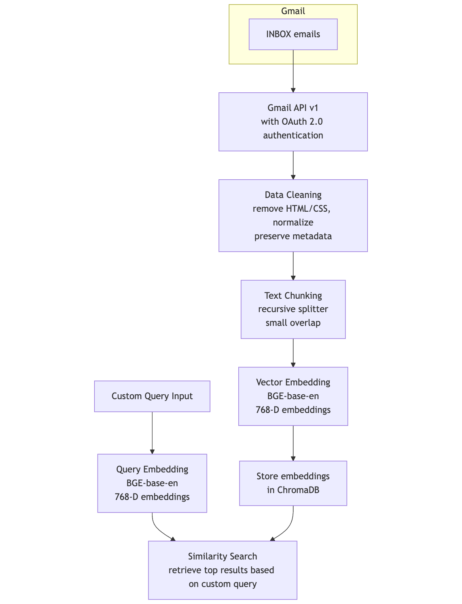

# RAG Architecture

# Introduction
This tool helps you identify which of your emails contain event information, so you don't have to manually search through them.

# Design
A simple RAG pipeline is used to index the emails. A custom query is then used to retrieve emails with event information.

You can find more detail about the design on my [portfolio](https://ashirrashid.github.io/portfolio/1-emailai/).

# Running
This code has been tested on Python 3.11

Install dependencies using `pip install -r requirements.txt`

Run the chroma server by running the command `chroma run --path ./db --host localhost --port 8000`

Get you access [Google access credentials](https://developers.google.com/workspace/guides/create-credentials) and place then in the current directory and spefiy the name using the `globals.py` file with the `GCAL_CREDENTIALS_FILE` variable name.

Run `gmail_load_pipeline.py` to retrieve your emails, chunk them, and index them usign Chroma.

Run `query_db.py` to find out which of your emails contain event information.
